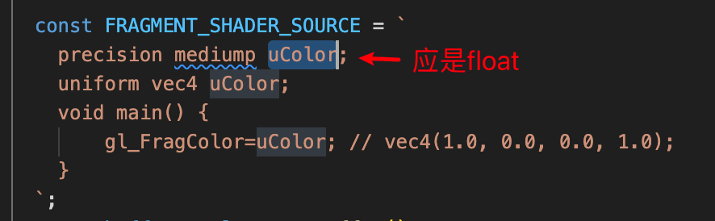
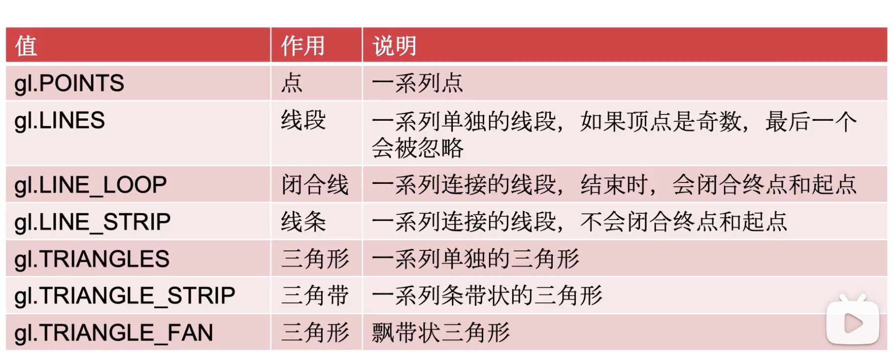

# webgl错误提示
## GL_INVALID_VALUE: glVertexAttrib4f: Index must be less than MAX_VERTEX_ATTRIBS

## GL_INVALID_VALUE: glVertexAttrib4f: Index must be less than MAX_VERTEX_ATTRIBS.
出现这个时，需用这个检查aProgram是否为-1
      const aProgram = gl.getAttribLocation(program, "aProgram");
      console.log("aProgram: ", aProgram);

      正常会返回非-1，如0

            const maxAttributes = gl.getParameter(gl.MAX_VERTEX_ATTRIBS);
      console.log("支持的最大顶点属性数量:", maxAttributes);

## INVALID_OPERATION: getUniformLocation: program not linked

## 可绘制的图形
